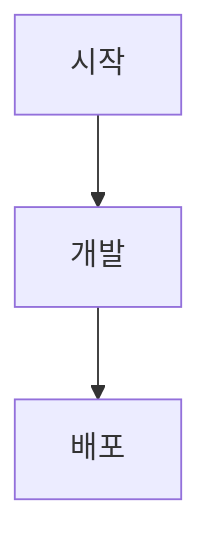

# 개인 블로그 & AI 학습 사이트 구현 계획

> **For agentic workers:** REQUIRED SUB-SKILL: Use superpowers:subagent-driven-development (recommended) or superpowers:executing-plans to implement this plan task-by-task. Steps use checkbox (`- [ ]`) syntax for tracking.

**Goal:** 우아한기술블로그 스타일의 개인 블로그 + AI 학습 사이트 구축 (파일 기반 MDX 콘텐츠, 태그 필터, 검색, 댓글, 뉴스레터)

**Architecture:** `content/posts/`에 MDX 파일을 추가하면 빌드 타임에 정적 페이지로 자동 생성된다. next-mdx-remote가 MDX를 파싱하고, Tailwind v4 + shadcn/ui로 UI를 구성한다. 댓글(Giscus)과 뉴스레터(Resend)는 클라이언트/API Routes로 처리한다.

**Tech Stack:** Next.js 15 (App Router), next-mdx-remote v5, Tailwind CSS v4, shadcn/ui, Mermaid.js, Giscus, Resend, Fuse.js, Vercel

---

## 파일 구조 전체 맵

```
ai-survival-log/              ← 기존 저장소에 사이트 추가
├── content/
│   └── posts/
│       └── sample-post.mdx           # 샘플 포스트
│
├── src/
│   ├── app/
│   │   ├── layout.tsx                # 루트 레이아웃 (헤더, 푸터, 테마)
│   │   ├── page.tsx                  # 메인 (최신 글 목록 + 태그 필터)
│   │   ├── posts/
│   │   │   └── [slug]/
│   │   │       └── page.tsx          # 개별 포스트 상세
│   │   ├── tags/
│   │   │   └── [tag]/
│   │   │       └── page.tsx          # 태그별 글 목록
│   │   ├── about/
│   │   │   └── page.tsx              # 소개 페이지
│   │   └── api/
│   │       └── newsletter/
│   │           └── route.ts          # 뉴스레터 구독 API (Resend)
│   │
│   ├── components/
│   │   ├── ui/                       # shadcn 자동 생성 컴포넌트
│   │   ├── layout/
│   │   │   ├── Header.tsx            # 로고 + 내비게이션 + 검색 버튼 + 테마 토글
│   │   │   └── Footer.tsx            # 소셜 링크 + 뉴스레터 폼
│   │   ├── post/
│   │   │   ├── PostCard.tsx          # 글 목록 카드
│   │   │   ├── PostList.tsx          # 카드 그리드 래퍼
│   │   │   ├── TagFilter.tsx         # 태그 필터 버튼 그룹
│   │   │   ├── TableOfContents.tsx   # 목차 (헤딩 자동 추출)
│   │   │   ├── PrevNextNav.tsx       # 이전/다음 글 네비게이션
│   │   │   └── GiscusComments.tsx    # Giscus 댓글 iframe
│   │   ├── mdx/
│   │   │   ├── MermaidRenderer.tsx   # Mermaid 다이어그램 렌더러
│   │   │   └── MDXComponents.tsx     # MDX 커스텀 컴포넌트 맵
│   │   ├── search/
│   │   │   └── SearchBar.tsx         # ⌘K Command 팝업 검색
│   │   └── newsletter/
│   │       └── NewsletterForm.tsx    # 이메일 구독 폼
│   │
│   └── lib/
│       ├── posts.ts                  # 포스트 파일 파싱 유틸 (getAllPosts, getPostBySlug)
│       ├── search.ts                 # Fuse.js 검색 인덱스 설정
│       └── types.ts                  # Post 타입 정의
│
├── package.json
├── next.config.ts
├── tailwind.config.ts
└── components.json                   # shadcn 설정
```

---

## Task 1: 프로젝트 초기 설정

**Files:**
- Create: `package.json`, `next.config.ts`, `tailwind.config.ts`, `components.json`
- Create: `src/app/layout.tsx`

- [ ] **Step 1: Next.js 15 프로젝트 생성**

```bash
cd /Users/ms/workspace/claude
npx create-next-app@latest ai-survival-log-site \
  --typescript \
  --tailwind \
  --eslint \
  --app \
  --src-dir \
  --import-alias "@/*" \
  --no-turbopack
```

> 주의: 기존 `ai-survival-log` 저장소가 있으므로 별도 디렉토리로 생성한다. 나중에 합칠 수 있다.

- [ ] **Step 2: 의존성 설치**

```bash
cd ai-survival-log-site
npm install next-mdx-remote@5 gray-matter reading-time
npm install fuse.js
npm install next-themes
npm install resend
npm install mermaid
npm install @tailwindcss/typography
```

- [ ] **Step 3: shadcn/ui 초기화**

```bash
npx shadcn@latest init
```

선택 옵션:
- Style: Default
- Base color: Neutral
- CSS variables: Yes

- [ ] **Step 4: 필요한 shadcn 컴포넌트 설치**

```bash
npx shadcn@latest add button badge card command input separator
```

- [ ] **Step 5: `next.config.ts` 설정**

```typescript
// next.config.ts
import type { NextConfig } from 'next'

const nextConfig: NextConfig = {
  pageExtensions: ['ts', 'tsx', 'md', 'mdx'],
}

export default nextConfig
```

- [ ] **Step 6: `content/posts/` 디렉토리와 샘플 포스트 생성**

```bash
mkdir -p content/posts
```

`content/posts/2026-04-09-hello-world.mdx`:
```mdx
---
title: "첫 번째 포스트"
date: "2026-04-09"
tags: ["blog", "welcome"]
description: "사이트 첫 포스트입니다."
draft: false
---

# 안녕하세요

이것은 샘플 포스트입니다.

## Mermaid 테스트



일반 마크다운 내용입니다.
```

- [ ] **Step 7: 커밋**

```bash
git add .
git commit -m "feat: Next.js 15 프로젝트 초기 설정"
```

---

## Task 2: 타입 정의 및 포스트 파싱 유틸

**Files:**
- Create: `src/lib/types.ts`
- Create: `src/lib/posts.ts`

- [ ] **Step 1: Post 타입 정의**

`src/lib/types.ts`:
```typescript
export interface PostMeta {
  title: string
  date: string
  tags: string[]
  description: string
  thumbnail?: string
  draft: boolean
  slug: string
  readingTime: string
}

export interface Post extends PostMeta {
  content: string
}
```

- [ ] **Step 2: 포스트 파싱 유틸 작성**

`src/lib/posts.ts`:
```typescript
import fs from 'fs'
import path from 'path'
import matter from 'gray-matter'
import readingTime from 'reading-time'
import type { Post, PostMeta } from './types'

const POSTS_DIR = path.join(process.cwd(), 'content/posts')

export function getAllPosts(): PostMeta[] {
  const files = fs.readdirSync(POSTS_DIR).filter(f => f.endsWith('.mdx') || f.endsWith('.md'))

  return files
    .map(filename => {
      const slug = filename.replace(/\.(mdx|md)$/, '')
      const filePath = path.join(POSTS_DIR, filename)
      const raw = fs.readFileSync(filePath, 'utf-8')
      const { data, content } = matter(raw)

      return {
        slug,
        title: data.title ?? slug,
        date: data.date ?? '',
        tags: data.tags ?? [],
        description: data.description ?? '',
        thumbnail: data.thumbnail,
        draft: data.draft ?? false,
        readingTime: readingTime(content).text,
      } satisfies PostMeta
    })
    .filter(post => !post.draft)
    .sort((a, b) => new Date(b.date).getTime() - new Date(a.date).getTime())
}

export function getPostBySlug(slug: string): Post {
  const extensions = ['mdx', 'md']
  let filePath = ''

  for (const ext of extensions) {
    const candidate = path.join(POSTS_DIR, `${slug}.${ext}`)
    if (fs.existsSync(candidate)) {
      filePath = candidate
      break
    }
  }

  if (!filePath) throw new Error(`Post not found: ${slug}`)

  const raw = fs.readFileSync(filePath, 'utf-8')
  const { data, content } = matter(raw)

  return {
    slug,
    title: data.title ?? slug,
    date: data.date ?? '',
    tags: data.tags ?? [],
    description: data.description ?? '',
    thumbnail: data.thumbnail,
    draft: data.draft ?? false,
    readingTime: readingTime(content).text,
    content,
  }
}

export function getAllTags(): string[] {
  const posts = getAllPosts()
  const tagSet = new Set(posts.flatMap(p => p.tags))
  return Array.from(tagSet).sort()
}

export function getPostsByTag(tag: string): PostMeta[] {
  return getAllPosts().filter(p => p.tags.includes(tag))
}
```

- [ ] **Step 3: 유틸 동작 확인**

```bash
node -e "
const { getAllPosts } = require('./src/lib/posts.ts')
console.log(getAllPosts())
"
```

Expected: 샘플 포스트 1개 출력

- [ ] **Step 4: 커밋**

```bash
git add src/lib/
git commit -m "feat: 포스트 파싱 유틸 및 타입 정의"
```

---

## Task 3: 루트 레이아웃 & 다크모드

**Files:**
- Modify: `src/app/layout.tsx`
- Create: `src/components/layout/Header.tsx`
- Create: `src/components/layout/Footer.tsx`

- [ ] **Step 1: ThemeProvider 설정**

`src/app/layout.tsx`:
```typescript
import type { Metadata } from 'next'
import { Inter } from 'next/font/google'
import { ThemeProvider } from 'next-themes'
import { Header } from '@/components/layout/Header'
import { Footer } from '@/components/layout/Footer'
import './globals.css'

const inter = Inter({ subsets: ['latin'] })

export const metadata: Metadata = {
  title: {
    default: 'AI Survival Log',
    template: '%s | AI Survival Log',
  },
  description: '개인 블로그 & AI 학습 기록',
}

export default function RootLayout({ children }: { children: React.ReactNode }) {
  return (
    <html lang="ko" suppressHydrationWarning>
      <body className={inter.className}>
        <ThemeProvider attribute="class" defaultTheme="system" enableSystem>
          <div className="min-h-screen flex flex-col">
            <Header />
            <main className="flex-1 container mx-auto px-4 py-8 max-w-4xl">
              {children}
            </main>
            <Footer />
          </div>
        </ThemeProvider>
      </body>
    </html>
  )
}
```

- [ ] **Step 2: Header 컴포넌트**

`src/components/layout/Header.tsx`:
```typescript
'use client'

import Link from 'next/link'
import { useTheme } from 'next-themes'
import { Button } from '@/components/ui/button'
import { Moon, Sun, Search } from 'lucide-react'

export function Header() {
  const { theme, setTheme } = useTheme()

  return (
    <header className="border-b">
      <div className="container mx-auto px-4 max-w-4xl h-16 flex items-center justify-between">
        <Link href="/" className="font-bold text-xl">
          AI Survival Log
        </Link>
        <nav className="flex items-center gap-4">
          <Link href="/about" className="text-sm text-muted-foreground hover:text-foreground">
            About
          </Link>
          <Button
            variant="ghost"
            size="icon"
            aria-label="검색"
            onClick={() => document.dispatchEvent(new KeyboardEvent('keydown', { key: 'k', metaKey: true }))}
          >
            <Search className="h-4 w-4" />
          </Button>
          <Button
            variant="ghost"
            size="icon"
            aria-label="테마 변경"
            onClick={() => setTheme(theme === 'dark' ? 'light' : 'dark')}
          >
            <Sun className="h-4 w-4 rotate-0 scale-100 transition-all dark:-rotate-90 dark:scale-0" />
            <Moon className="absolute h-4 w-4 rotate-90 scale-0 transition-all dark:rotate-0 dark:scale-100" />
          </Button>
        </nav>
      </div>
    </header>
  )
}
```

- [ ] **Step 3: Footer 컴포넌트**

`src/components/layout/Footer.tsx`:
```typescript
import { NewsletterForm } from '@/components/newsletter/NewsletterForm'

export function Footer() {
  return (
    <footer className="border-t mt-16">
      <div className="container mx-auto px-4 max-w-4xl py-12">
        <NewsletterForm />
        <p className="text-center text-sm text-muted-foreground mt-8">
          © 2026 AI Survival Log
        </p>
      </div>
    </footer>
  )
}
```

- [ ] **Step 4: `lucide-react` 설치**

```bash
npm install lucide-react
```

- [ ] **Step 5: 개발 서버 실행 후 레이아웃 확인**

```bash
npm run dev
```

브라우저에서 `http://localhost:3000` 확인. 헤더/푸터 렌더링 확인.

- [ ] **Step 6: 커밋**

```bash
git add src/app/layout.tsx src/components/layout/
git commit -m "feat: 루트 레이아웃, 헤더, 푸터, 다크모드"
```

---

## Task 4: PostCard & TagFilter 컴포넌트

**Files:**
- Create: `src/components/post/PostCard.tsx`
- Create: `src/components/post/PostList.tsx`
- Create: `src/components/post/TagFilter.tsx`

- [ ] **Step 1: PostCard 컴포넌트**

`src/components/post/PostCard.tsx`:
```typescript
import Link from 'next/link'
import { Card, CardContent, CardHeader, CardTitle } from '@/components/ui/card'
import { Badge } from '@/components/ui/badge'
import type { PostMeta } from '@/lib/types'

interface PostCardProps {
  post: PostMeta
}

export function PostCard({ post }: PostCardProps) {
  return (
    <Link href={`/posts/${post.slug}`}>
      <Card className="hover:shadow-md transition-shadow cursor-pointer h-full">
        {post.thumbnail && (
          <div className="aspect-video overflow-hidden rounded-t-lg">
            
          </div>
        )}
        <CardHeader>
          <div className="flex flex-wrap gap-1 mb-2">
            {post.tags.map(tag => (
              <Badge key={tag} variant="secondary" className="text-xs">
                {tag}
              </Badge>
            ))}
          </div>
          <CardTitle className="text-lg line-clamp-2">{post.title}</CardTitle>
        </CardHeader>
        <CardContent>
          <p className="text-sm text-muted-foreground line-clamp-2 mb-3">
            {post.description}
          </p>
          <div className="flex items-center gap-2 text-xs text-muted-foreground">
            <span>{post.date}</span>
            <span>·</span>
            <span>{post.readingTime}</span>
          </div>
        </CardContent>
      </Card>
    </Link>
  )
}
```

- [ ] **Step 2: PostList 컴포넌트**

`src/components/post/PostList.tsx`:
```typescript
import { PostCard } from './PostCard'
import type { PostMeta } from '@/lib/types'

interface PostListProps {
  posts: PostMeta[]
}

export function PostList({ posts }: PostListProps) {
  if (posts.length === 0) {
    return (
      <p className="text-center text-muted-foreground py-16">
        포스트가 없습니다.
      </p>
    )
  }

  return (
    <div className="grid grid-cols-1 md:grid-cols-2 gap-6">
      {posts.map(post => (
        <PostCard key={post.slug} post={post} />
      ))}
    </div>
  )
}
```

- [ ] **Step 3: TagFilter 컴포넌트**

`src/components/post/TagFilter.tsx`:
```typescript
'use client'

import { useRouter, useSearchParams } from 'next/navigation'
import { Badge } from '@/components/ui/badge'
import { cn } from '@/lib/utils'

interface TagFilterProps {
  tags: string[]
  selectedTag?: string
}

export function TagFilter({ tags, selectedTag }: TagFilterProps) {
  const router = useRouter()
  const searchParams = useSearchParams()

  function handleTagClick(tag: string) {
    if (tag === selectedTag) {
      router.push('/')
    } else {
      router.push(`/tags/${tag}`)
    }
  }

  return (
    <div className="flex flex-wrap gap-2 mb-8">
      <Badge
        variant={!selectedTag ? 'default' : 'outline'}
        className="cursor-pointer"
        onClick={() => router.push('/')}
      >
        전체
      </Badge>
      {tags.map(tag => (
        <Badge
          key={tag}
          variant={tag === selectedTag ? 'default' : 'outline'}
          className="cursor-pointer"
          onClick={() => handleTagClick(tag)}
        >
          {tag}
        </Badge>
      ))}
    </div>
  )
}
```

- [ ] **Step 4: 커밋**

```bash
git add src/components/post/
git commit -m "feat: PostCard, PostList, TagFilter 컴포넌트"
```

---

## Task 5: 메인 페이지 (글 목록)

**Files:**
- Modify: `src/app/page.tsx`

- [ ] **Step 1: 메인 페이지 구현**

`src/app/page.tsx`:
```typescript
import { getAllPosts, getAllTags } from '@/lib/posts'
import { PostList } from '@/components/post/PostList'
import { TagFilter } from '@/components/post/TagFilter'
import { Suspense } from 'react'

export default function HomePage() {
  const posts = getAllPosts()
  const tags = getAllTags()

  return (
    <div>
      <div className="mb-8">
        <h1 className="text-3xl font-bold mb-2">AI Survival Log</h1>
        <p className="text-muted-foreground">개인 블로그 & AI 학습 기록</p>
      </div>
      <Suspense>
        <TagFilter tags={tags} />
      </Suspense>
      <PostList posts={posts} />
    </div>
  )
}
```

- [ ] **Step 2: 브라우저에서 메인 페이지 확인**

```bash
npm run dev
```

`http://localhost:3000` 에서 카드 목록과 태그 필터 확인.

- [ ] **Step 3: 커밋**

```bash
git add src/app/page.tsx
git commit -m "feat: 메인 페이지 (글 목록 + 태그 필터)"
```

---

## Task 6: Mermaid 렌더러 & MDX 컴포넌트

**Files:**
- Create: `src/components/mdx/MermaidRenderer.tsx`
- Create: `src/components/mdx/MDXComponents.tsx`

- [ ] **Step 1: MermaidRenderer 컴포넌트**

`src/components/mdx/MermaidRenderer.tsx`:
```typescript
'use client'

import { useEffect, useRef } from 'react'

interface MermaidRendererProps {
  chart: string
}

export function MermaidRenderer({ chart }: MermaidRendererProps) {
  const ref = useRef<HTMLDivElement>(null)

  useEffect(() => {
    async function render() {
      const mermaid = (await import('mermaid')).default
      mermaid.initialize({ startOnLoad: false, theme: 'default' })
      if (ref.current) {
        ref.current.innerHTML = ''
        const id = `mermaid-${Math.random().toString(36).slice(2)}`
        const { svg } = await mermaid.render(id, chart)
        ref.current.innerHTML = svg
      }
    }
    render()
  }, [chart])

  return <div ref={ref} className="my-4 overflow-x-auto" />
}
```

- [ ] **Step 2: MDX 코드 블록에서 Mermaid 자동 처리**

`src/components/mdx/MDXComponents.tsx`:
```typescript
import { MermaidRenderer } from './MermaidRenderer'
import type { MDXComponents } from 'mdx/types'

export const mdxComponents: MDXComponents = {
  pre: ({ children, ...props }: React.HTMLAttributes<HTMLPreElement> & { children?: React.ReactNode }) => {
    const child = children as React.ReactElement<{ className?: string; children?: string }>
    if (child?.props?.className === 'language-mermaid') {
      return <MermaidRenderer chart={child.props.children ?? ''} />
    }
    return <pre {...props}>{children}</pre>
  },
  code: ({ className, children, ...props }: React.HTMLAttributes<HTMLElement> & { children?: React.ReactNode }) => {
    return (
      <code
        className={`${className ?? ''} bg-muted px-1 py-0.5 rounded text-sm`}
        {...props}
      >
        {children}
      </code>
    )
  },
}
```

- [ ] **Step 3: 커밋**

```bash
git add src/components/mdx/
git commit -m "feat: Mermaid 렌더러 및 MDX 커스텀 컴포넌트"
```

---

## Task 7: 포스트 상세 페이지

**Files:**
- Create: `src/app/posts/[slug]/page.tsx`
- Create: `src/components/post/TableOfContents.tsx`
- Create: `src/components/post/PrevNextNav.tsx`
- Create: `src/components/post/GiscusComments.tsx`

- [ ] **Step 1: 목차(TOC) 컴포넌트**

`src/components/post/TableOfContents.tsx`:
```typescript
'use client'

import { useEffect, useState } from 'react'

interface Heading {
  id: string
  text: string
  level: number
}

export function TableOfContents() {
  const [headings, setHeadings] = useState<Heading[]>([])

  useEffect(() => {
    const elements = document.querySelectorAll('h2, h3')
    const items: Heading[] = Array.from(elements).map(el => ({
      id: el.id,
      text: el.textContent ?? '',
      level: parseInt(el.tagName[1]),
    }))
    setHeadings(items)
  }, [])

  if (headings.length === 0) return null

  return (
    <nav className="text-sm">
      <p className="font-semibold mb-2">목차</p>
      <ul className="space-y-1">
        {headings.map(h => (
          <li key={h.id} style={{ paddingLeft: `${(h.level - 2) * 12}px` }}>
            <a
              href={`#${h.id}`}
              className="text-muted-foreground hover:text-foreground transition-colors"
            >
              {h.text}
            </a>
          </li>
        ))}
      </ul>
    </nav>
  )
}
```

- [ ] **Step 2: 이전/다음 글 네비게이션**

`src/components/post/PrevNextNav.tsx`:
```typescript
import Link from 'next/link'
import { ChevronLeft, ChevronRight } from 'lucide-react'
import type { PostMeta } from '@/lib/types'

interface PrevNextNavProps {
  prev: PostMeta | null
  next: PostMeta | null
}

export function PrevNextNav({ prev, next }: PrevNextNavProps) {
  return (
    <div className="flex justify-between mt-12 pt-8 border-t">
      {prev ? (
        <Link href={`/posts/${prev.slug}`} className="flex items-center gap-2 text-sm hover:text-foreground text-muted-foreground max-w-[45%]">
          <ChevronLeft className="h-4 w-4 shrink-0" />
          <span className="line-clamp-1">{prev.title}</span>
        </Link>
      ) : <div />}
      {next ? (
        <Link href={`/posts/${next.slug}`} className="flex items-center gap-2 text-sm hover:text-foreground text-muted-foreground max-w-[45%] text-right">
          <span className="line-clamp-1">{next.title}</span>
          <ChevronRight className="h-4 w-4 shrink-0" />
        </Link>
      ) : <div />}
    </div>
  )
}
```

- [ ] **Step 3: Giscus 댓글 컴포넌트**

`src/components/post/GiscusComments.tsx`:
```typescript
'use client'

import { useEffect, useRef } from 'react'
import { useTheme } from 'next-themes'

export function GiscusComments() {
  const ref = useRef<HTMLDivElement>(null)
  const { resolvedTheme } = useTheme()

  useEffect(() => {
    if (!ref.current) return
    ref.current.innerHTML = ''

    const script = document.createElement('script')
    script.src = 'https://giscus.app/client.js'
    script.setAttribute('data-repo', process.env.NEXT_PUBLIC_GISCUS_REPO ?? '')
    script.setAttribute('data-repo-id', process.env.NEXT_PUBLIC_GISCUS_REPO_ID ?? '')
    script.setAttribute('data-category', process.env.NEXT_PUBLIC_GISCUS_CATEGORY ?? 'General')
    script.setAttribute('data-category-id', process.env.NEXT_PUBLIC_GISCUS_CATEGORY_ID ?? '')
    script.setAttribute('data-mapping', 'pathname')
    script.setAttribute('data-reactions-enabled', '1')
    script.setAttribute('data-theme', resolvedTheme === 'dark' ? 'dark' : 'light')
    script.setAttribute('crossorigin', 'anonymous')
    script.async = true

    ref.current.appendChild(script)
  }, [resolvedTheme])

  return <div ref={ref} className="mt-12" />
}
```

- [ ] **Step 4: `.env.local` 환경변수 템플릿 생성**

`.env.local.example`:
```
NEXT_PUBLIC_GISCUS_REPO=your-github-username/your-repo
NEXT_PUBLIC_GISCUS_REPO_ID=your-repo-id
NEXT_PUBLIC_GISCUS_CATEGORY=General
NEXT_PUBLIC_GISCUS_CATEGORY_ID=your-category-id
RESEND_API_KEY=re_xxxxxxxxxxxx
```

> Giscus 설정값은 https://giscus.app 에서 저장소 연결 후 발급받는다.

- [ ] **Step 5: 포스트 상세 페이지**

`src/app/posts/[slug]/page.tsx`:
```typescript
import { notFound } from 'next/navigation'
import { MDXRemote } from 'next-mdx-remote/rsc'
import { getAllPosts, getPostBySlug } from '@/lib/posts'
import { mdxComponents } from '@/components/mdx/MDXComponents'
import { TableOfContents } from '@/components/post/TableOfContents'
import { PrevNextNav } from '@/components/post/PrevNextNav'
import { GiscusComments } from '@/components/post/GiscusComments'
import { Badge } from '@/components/ui/badge'
import type { Metadata } from 'next'

interface Props {
  params: Promise<{ slug: string }>
}

export async function generateStaticParams() {
  const posts = getAllPosts()
  return posts.map(p => ({ slug: p.slug }))
}

export async function generateMetadata({ params }: Props): Promise<Metadata> {
  const { slug } = await params
  const post = getPostBySlug(slug)
  return {
    title: post.title,
    description: post.description,
  }
}

export default async function PostPage({ params }: Props) {
  const { slug } = await params

  let post
  try {
    post = getPostBySlug(slug)
  } catch {
    notFound()
  }

  const allPosts = getAllPosts()
  const currentIndex = allPosts.findIndex(p => p.slug === slug)
  const prev = currentIndex < allPosts.length - 1 ? allPosts[currentIndex + 1] : null
  const next = currentIndex > 0 ? allPosts[currentIndex - 1] : null

  return (
    <article>
      <header className="mb-8">
        <div className="flex flex-wrap gap-2 mb-3">
          {post.tags.map(tag => (
            <Badge key={tag} variant="secondary">{tag}</Badge>
          ))}
        </div>
        <h1 className="text-3xl font-bold mb-3">{post.title}</h1>
        <div className="flex items-center gap-2 text-sm text-muted-foreground">
          <span>{post.date}</span>
          <span>·</span>
          <span>{post.readingTime}</span>
        </div>
      </header>

      <div className="lg:grid lg:grid-cols-[1fr_200px] lg:gap-8">
        <div className="prose prose-neutral dark:prose-invert max-w-none">
          <MDXRemote source={post.content} components={mdxComponents} />
        </div>
        <aside className="hidden lg:block sticky top-8 h-fit">
          <TableOfContents />
        </aside>
      </div>

      <PrevNextNav prev={prev} next={next} />
      <GiscusComments />
    </article>
  )
}
```

- [ ] **Step 6: 브라우저에서 포스트 상세 확인**

```bash
npm run dev
```

`http://localhost:3000/posts/2026-04-09-hello-world` 에서 MDX 렌더링, Mermaid 다이어그램 확인.

- [ ] **Step 7: 커밋**

```bash
git add src/app/posts/ src/components/post/ .env.local.example
git commit -m "feat: 포스트 상세 페이지 (MDX, Mermaid, TOC, 댓글)"
```

---

## Task 8: 태그 페이지

**Files:**
- Create: `src/app/tags/[tag]/page.tsx`

- [ ] **Step 1: 태그별 포스트 목록 페이지**

`src/app/tags/[tag]/page.tsx`:
```typescript
import { notFound } from 'next/navigation'
import { getAllTags, getPostsByTag } from '@/lib/posts'
import { PostList } from '@/components/post/PostList'
import { TagFilter } from '@/components/post/TagFilter'
import { Suspense } from 'react'
import type { Metadata } from 'next'

interface Props {
  params: Promise<{ tag: string }>
}

export async function generateStaticParams() {
  const tags = getAllTags()
  return tags.map(tag => ({ tag }))
}

export async function generateMetadata({ params }: Props): Promise<Metadata> {
  const { tag } = await params
  return { title: `#${tag}` }
}

export default async function TagPage({ params }: Props) {
  const { tag } = await params
  const allTags = getAllTags()

  if (!allTags.includes(tag)) notFound()

  const posts = getPostsByTag(tag)

  return (
    <div>
      <h1 className="text-2xl font-bold mb-6">#{tag}</h1>
      <Suspense>
        <TagFilter tags={allTags} selectedTag={tag} />
      </Suspense>
      <PostList posts={posts} />
    </div>
  )
}
```

- [ ] **Step 2: 태그 페이지 확인**

```bash
npm run dev
```

`http://localhost:3000/tags/blog` 에서 해당 태그 글 목록 확인.

- [ ] **Step 3: 커밋**

```bash
git add src/app/tags/
git commit -m "feat: 태그별 글 목록 페이지"
```

---

## Task 9: 검색 (⌘K)

**Files:**
- Create: `src/lib/search.ts`
- Create: `src/components/search/SearchBar.tsx`
- Modify: `src/components/layout/Header.tsx`

- [ ] **Step 1: Fuse.js 검색 설정**

`src/lib/search.ts`:
```typescript
import Fuse from 'fuse.js'
import type { PostMeta } from './types'

export function createSearchIndex(posts: PostMeta[]) {
  return new Fuse(posts, {
    keys: [
      { name: 'title', weight: 0.6 },
      { name: 'description', weight: 0.3 },
      { name: 'tags', weight: 0.1 },
    ],
    threshold: 0.4,
  })
}
```

- [ ] **Step 2: SearchBar 컴포넌트**

`src/components/search/SearchBar.tsx`:
```typescript
'use client'

import { useEffect, useState } from 'react'
import { useRouter } from 'next/navigation'
import {
  CommandDialog,
  CommandEmpty,
  CommandGroup,
  CommandInput,
  CommandItem,
  CommandList,
} from '@/components/ui/command'
import { createSearchIndex } from '@/lib/search'
import type { PostMeta } from '@/lib/types'

interface SearchBarProps {
  posts: PostMeta[]
}

export function SearchBar({ posts }: SearchBarProps) {
  const [open, setOpen] = useState(false)
  const [query, setQuery] = useState('')
  const router = useRouter()

  const fuse = createSearchIndex(posts)
  const results = query ? fuse.search(query).slice(0, 8) : []

  useEffect(() => {
    function handleKeyDown(e: KeyboardEvent) {
      if (e.key === 'k' && (e.metaKey || e.ctrlKey)) {
        e.preventDefault()
        setOpen(prev => !prev)
      }
    }
    document.addEventListener('keydown', handleKeyDown)
    return () => document.removeEventListener('keydown', handleKeyDown)
  }, [])

  function handleSelect(slug: string) {
    setOpen(false)
    router.push(`/posts/${slug}`)
  }

  return (
    <CommandDialog open={open} onOpenChange={setOpen}>
      <CommandInput
        placeholder="글 검색..."
        value={query}
        onValueChange={setQuery}
      />
      <CommandList>
        <CommandEmpty>검색 결과가 없습니다.</CommandEmpty>
        {results.length > 0 && (
          <CommandGroup heading="포스트">
            {results.map(({ item }) => (
              <CommandItem
                key={item.slug}
                value={item.slug}
                onSelect={() => handleSelect(item.slug)}
              >
                <div>
                  <p className="font-medium">{item.title}</p>
                  <p className="text-xs text-muted-foreground">{item.description}</p>
                </div>
              </CommandItem>
            ))}
          </CommandGroup>
        )}
      </CommandList>
    </CommandDialog>
  )
}
```

- [ ] **Step 3: SearchBar를 레이아웃에 추가**

`src/app/layout.tsx` 수정 — SearchBar에 posts 전달:
```typescript
// layout.tsx에 추가
import { getAllPosts } from '@/lib/posts'
import { SearchBar } from '@/components/search/SearchBar'

// RootLayout 내부에 추가
const posts = getAllPosts()

// ThemeProvider 내부에 추가
<SearchBar posts={posts} />
```

- [ ] **Step 4: ⌘K 검색 동작 확인**

브라우저에서 `⌘K` (Mac) 또는 `Ctrl+K` (Windows) 입력 후 검색 팝업 확인.

- [ ] **Step 5: 커밋**

```bash
git add src/lib/search.ts src/components/search/ src/app/layout.tsx
git commit -m "feat: ⌘K 검색 (Fuse.js + shadcn Command)"
```

---

## Task 10: 뉴스레터 (Resend)

**Files:**
- Create: `src/app/api/newsletter/route.ts`
- Create: `src/components/newsletter/NewsletterForm.tsx`

- [ ] **Step 1: 뉴스레터 API Route**

`src/app/api/newsletter/route.ts`:
```typescript
import { NextRequest, NextResponse } from 'next/server'
import { Resend } from 'resend'

const resend = new Resend(process.env.RESEND_API_KEY)

export async function POST(req: NextRequest) {
  const { email } = await req.json()

  if (!email || !email.includes('@')) {
    return NextResponse.json({ error: '유효하지 않은 이메일입니다.' }, { status: 400 })
  }

  try {
    await resend.contacts.create({
      email,
      audienceId: process.env.RESEND_AUDIENCE_ID ?? '',
    })
    return NextResponse.json({ success: true })
  } catch (error) {
    return NextResponse.json({ error: '구독 처리 중 오류가 발생했습니다.' }, { status: 500 })
  }
}
```

- [ ] **Step 2: NewsletterForm 컴포넌트**

`src/components/newsletter/NewsletterForm.tsx`:
```typescript
'use client'

import { useState } from 'react'
import { Input } from '@/components/ui/input'
import { Button } from '@/components/ui/button'

export function NewsletterForm() {
  const [email, setEmail] = useState('')
  const [status, setStatus] = useState<'idle' | 'loading' | 'success' | 'error'>('idle')

  async function handleSubmit(e: React.FormEvent) {
    e.preventDefault()
    setStatus('loading')

    const res = await fetch('/api/newsletter', {
      method: 'POST',
      headers: { 'Content-Type': 'application/json' },
      body: JSON.stringify({ email }),
    })

    if (res.ok) {
      setStatus('success')
      setEmail('')
    } else {
      setStatus('error')
    }
  }

  return (
    <div className="text-center max-w-md mx-auto">
      <h3 className="font-semibold text-lg mb-1">새 글 알림 받기</h3>
      <p className="text-sm text-muted-foreground mb-4">
        새 포스트가 올라오면 이메일로 알려드립니다.
      </p>
      {status === 'success' ? (
        <p className="text-sm text-green-600">구독해주셔서 감사합니다!</p>
      ) : (
        <form onSubmit={handleSubmit} className="flex gap-2">
          <Input
            type="email"
            placeholder="이메일 주소"
            value={email}
            onChange={e => setEmail(e.target.value)}
            required
            disabled={status === 'loading'}
          />
          <Button type="submit" disabled={status === 'loading'}>
            {status === 'loading' ? '처리 중...' : '구독'}
          </Button>
        </form>
      )}
      {status === 'error' && (
        <p className="text-sm text-red-500 mt-2">오류가 발생했습니다. 다시 시도해주세요.</p>
      )}
    </div>
  )
}
```

- [ ] **Step 3: `.env.local`에 Resend 키 추가**

```
RESEND_API_KEY=re_xxxxxxxxxxxx
RESEND_AUDIENCE_ID=your-audience-id
```

> Resend 키는 https://resend.com 에서 발급.

- [ ] **Step 4: 커밋**

```bash
git add src/app/api/ src/components/newsletter/
git commit -m "feat: 뉴스레터 구독 (Resend API)"
```

---

## Task 11: About 페이지

**Files:**
- Create: `src/app/about/page.tsx`

- [ ] **Step 1: About 페이지 작성**

`src/app/about/page.tsx`:
```typescript
import type { Metadata } from 'next'

export const metadata: Metadata = { title: 'About' }

export default function AboutPage() {
  return (
    <div className="max-w-2xl">
      <h1 className="text-3xl font-bold mb-6">About</h1>
      <div className="prose prose-neutral dark:prose-invert">
        <p>
          안녕하세요. 이 블로그는 개인 개발 기록과 AI 학습 내용을 정리하는 공간입니다.
        </p>
        <h2>주요 주제</h2>
        <ul>
          <li>AI / LLM 학습 정리</li>
          <li>Claude Code 활용</li>
          <li>개발 일지</li>
        </ul>
      </div>
    </div>
  )
}
```

- [ ] **Step 2: 커밋**

```bash
git add src/app/about/
git commit -m "feat: About 페이지"
```

---

## Task 12: 빌드 검증 & Vercel 배포

**Files:**
- Create: `vercel.json` (선택)

- [ ] **Step 1: 프로덕션 빌드 확인**

```bash
npm run build
```

Expected: `✓ Compiled successfully` — 에러 없이 완료

- [ ] **Step 2: 빌드 결과 확인**

```bash
npm run start
```

`http://localhost:3000` 에서 전체 기능 확인:
- 메인 글 목록
- 태그 필터 클릭
- 포스트 상세 + Mermaid
- ⌘K 검색
- 다크모드 토글

- [ ] **Step 3: GitHub에 push**

```bash
git push origin main
```

- [ ] **Step 4: Vercel 연결**

1. https://vercel.com/new 접속
2. GitHub 저장소 선택
3. 환경변수 입력 (`.env.local.example` 참고)
4. Deploy 클릭

- [ ] **Step 5: Giscus 설정**

1. https://giscus.app 접속
2. 저장소 입력 → 설정값 복사
3. Vercel 환경변수에 추가 후 재배포

---

## 스펙 커버리지 체크

| 스펙 요구사항 | 구현 Task |
|---|---|
| Next.js 15 + next-mdx-remote | Task 1, 7 |
| Tailwind v4 + shadcn/ui | Task 1, 4 |
| Mermaid.js | Task 6 |
| 파일 기반 콘텐츠 (`content/posts/`) | Task 1, 2 |
| Frontmatter (title/date/tags/description/draft) | Task 2 |
| 복수 태그 지원 | Task 2, 4 |
| 카드형 글 목록 | Task 4, 5 |
| 태그 필터 | Task 4, 5, 8 |
| 포스트 상세 + TOC | Task 7 |
| 이전/다음 네비게이션 | Task 7 |
| Giscus 댓글 | Task 7 |
| ⌘K 검색 | Task 9 |
| 뉴스레터 (Resend) | Task 10 |
| 다크모드 | Task 3 |
| About 페이지 | Task 11 |
| Vercel 배포 | Task 12 |
